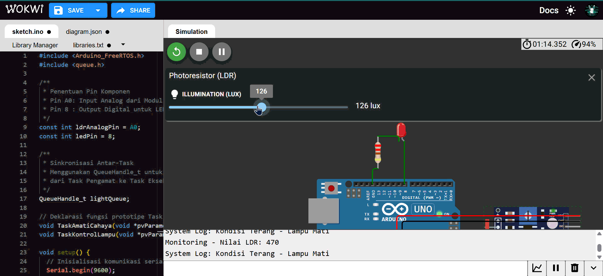

# Smart Street Light Otomatis dengan FreeRTOS

Proyek ini adalah simulasi sistem Lampu Jalan Otomatis (Smart Street Light) berbasis mikrokontroler Arduino Uno yang diimplementasikan menggunakan **FreeRTOS**. Sistem memanfaatkan sensor LDR untuk mendeteksi intensitas cahaya lingkungan secara *real-time* dan menyalakan LED secara otomatis saat kondisi lingkungan menjadi gelap.

## Demo Proyek
| Simulasi|
| :---: |
|  |

## Alat dan Komponen
* Mikrokontroler: Arduino Uno
* Sensor: Modul LDR (Analog Output)
* Aktuator: LED 
* Resistor: 220 Ohm (untuk proteksi arus LED)
* Simulator: Wokwi

## Arsitektur RTOS & Penjelasan Task
Sistem ini menggunakan konsep *multitasking* di mana fungsi-fungsi berjalan secara independen namun tetap tersinkronisasi. Sinkronisasi data antar-task dilakukan menggunakan mekanisme **Queue** (`QueueHandle_t`). 

Terdapat 2 Task utama yang bekerja pada sistem ini:

### 1. TaskAmatiCahaya (Producer)
* **Fungsi:** Bertugas membaca data intensitas cahaya dari pin analog LDR secara berkala (setiap 500ms) untuk menjaga efisiensi CPU.
* **Logika:** Mengonversi nilai pembacaan sensor menjadi status integer (`1` untuk kondisi Gelap, `0` untuk kondisi Terang) berdasarkan nilai ambang batas (*threshold*).
* **Peran Sinkronisasi:** Memasukkan nilai status cahaya tersebut ke dalam antrean (Queue) menggunakan fungsi `xQueueSend`.

### 2. TaskKontrolLampu (Consumer)
* **Fungsi:** Mengontrol nyala dan matinya lampu jalan (LED) pada pin output digital.
* **Peran Sinkronisasi:** Task ini menerapkan sistem *event-driven*. Task berada dalam *state Blocked* (menunggu) dan hanya akan aktif mengeksekusi perintah (`HIGH` atau `LOW`) tepat ketika fungsi `xQueueReceive` berhasil menerima data sinyal yang dikirimkan oleh Task 1.
